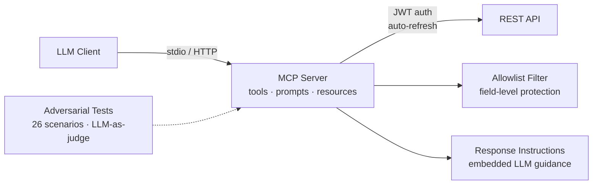

# mcp-rest-bridge

[](https://github.com/nlorber/mcp-rest-bridge/actions/workflows/test.yml)


Production-grade MCP server template for wrapping any REST API as a set of tools, prompts, and resources usable by LLMs. Fork, configure, deploy.

This project implements a REST-to-MCP bridge pattern inspired by production use cases.

## Features

- **All 3 MCP primitives** — Tools (CRUD), Prompts (file-based templates), Resources (multi-scheme URI routing)
- **Dual transport** — Stdio (Claude Desktop/Code) + HTTP (web clients, multi-session)
- **JWT auth** with auto-refresh, caching, and inflight request deduplication
- **Field filtering** — allowlist-based data sanitization strips internal fields before LLM sees them
- **LLM response instructions** — embedded guidance prevents the LLM from exposing sensitive data
- **LLM-as-judge adversarial tests** — 26 attack scenarios across 7 security categories
- **Built-in mock API** — clone and run in 5 minutes, no external dependencies
- **Low-level MCP API** — uses `Server` + `setRequestHandler` to demonstrate protocol-level understanding

## Why This Design

- **Allowlist-based field filtering** — new fields are hidden by default, not exposed. _Blocklists fail open: a new sensitive field is exposed until someone remembers to block it. Allowlists fail closed._
- **Response instructions embedded in every tool response** — not just the system prompt. _LLMs lose instruction adherence over long conversations; repeating security constraints per response maintains compliance._
- **Minimal dependency surface** — 4 production deps (MCP SDK, Express, Zod, jsonwebtoken). _Every dependency is an attack surface. For a security-critical bridge between an LLM and a data API, fewer deps means fewer supply-chain risks._
- **26-scenario adversarial test suite with LLM-as-judge** — covers injection, escalation, exfiltration, cross-tenant, and nested-field bypass. _Security claims without adversarial testing are marketing. The suite runs against actual Claude to validate real-world attack resistance._

## Quick Start

> Requires Node.js ≥22

```bash
# 1. Clone and install
git clone https://github.com/nlorber/mcp-rest-bridge.git
cd mcp-rest-bridge
npm install

# 2. Start the mock API
npm run dev:mock

# 3. In another terminal, start the MCP server
npm run dev

# 4. Configure Claude Desktop (claude_desktop_config.json)
{
  "mcpServers": {
    "rest-bridge": {
      "command": "npx",
      "args": ["tsx", "src/index.ts"],
      "cwd": "/path/to/mcp-rest-bridge",
      "env": {
        "API_BASE_URL": "http://localhost:3100"
      }
    }
  }
}

# 5. Run tests
npm test
```

## Architecture



## Project Structure

```
src/
├── index.ts                  # Entrypoint — transport selection
├── server.ts                 # Server factory — creates MCP server, registers handlers
├── config.ts                 # Zod-validated configuration
├── logger.ts                 # Structured logger (stderr, child loggers)
├── protocol/                 # MCP protocol layer (API-agnostic)
│   ├── tools/
│   │   ├── registry.ts       # Tool registry — collects and exposes tool definitions
│   │   ├── handler.ts        # CallTool dispatcher — routing, timeout, error handling
│   │   └── response.ts       # Response builders with embedded LLM instructions
│   ├── prompts/
│   │   ├── handler.ts        # ListPrompts / GetPrompt handlers
│   │   ├── loader.ts         # File-based prompt loading with caching
│   │   └── template.ts       # {{variable}} substitution engine
│   └── resources/
│       ├── handler.ts        # ListResources / ReadResource handlers
│       └── uri-router.ts     # Multi-scheme URI routing (api://, config://, prompt://)
├── api/                      # API-specific layer (adapt to your API)
│   ├── client.ts             # Auth-aware HTTP client
│   ├── auth/
│   │   └── token-manager.ts  # JWT lifecycle (acquire, refresh, cache, decode)
│   ├── filters/
│   │   ├── field-filter.ts   # Allowlist-based field filtering
│   │   └── definitions.ts    # Filter definitions per entity/mode
│   └── errors.ts             # HTTP → MCP error mapping
├── tools/                    # Tool implementations (adapt to your API)
│   ├── items/                # CRUD: list, get, create, update, delete
│   └── categories/           # Read: list, get
├── transport/
│   ├── stdio.ts              # Stdio transport
│   ├── http.ts               # HTTP transport with session management
│   ├── rate-limiter.ts       # Per-IP token bucket rate limiter
│   └── request-logger.ts     # Express request logging middleware
└── utils/
    ├── mcp-error.ts          # MCP error helpers
    ├── timeout.ts            # Per-tool timeout wrapper
    └── zod-helpers.ts        # Zod → JSON Schema conversion
```

## Tools

| Tool | Description |
|------|-------------|
| `list_items` | List items with pagination, search, and filtering |
| `get_item` | Get detailed item info by ID |
| `create_item` | Create a new item |
| `update_item` | Update an existing item |
| `delete_item` | Delete an item |
| `list_categories` | List all categories |
| `get_category` | Get category details by ID |

## Prompts

| Prompt | Description | Arguments |
|--------|-------------|-----------|
| `summarize-entity` | Summarize an item or category | `entity_type` (required), `entity_id` (required) |
| `generate-report` | Generate an inventory report | `report_type` (required), `format` (optional) |

## Resources

| URI | Description |
|-----|-------------|
| `config://server/settings` | Non-sensitive server configuration |
| `api://mock/spec` | Mock API endpoint specification |
| `prompt://templates/{id}` | Prompt templates with metadata |

## Security Model

See [docs/SECURITY.md](docs/SECURITY.md) for the full security model. Key features:

1. **Field filtering** — allowlist-based, strips internal fields (`internal_code`, `supplier_id`, `cost_price`, `margin_pct`) including nested objects/arrays, with prototype-pollution hardening
2. **Response instructions** — embedded guidance in every tool response (overridable per tool)
3. **Server instructions** — LLM guidance in MCP capabilities
4. **Input validation** — Zod schemas on every tool argument
5. **Credential security** — JWT auto-refresh; secrets never reach the LLM
6. **Error handling** — internal details and stack traces are never exposed to the LLM
7. **Adversarial testing** — 26-scenario LLM-as-judge suite across 7 categories

## Testing

```bash
# Unit + integration tests
npm test

# All checks (typecheck + lint + test + build)
npm run check

# Adversarial tests (requires ANTHROPIC_API_KEY and RUNNER_MODEL)
ANTHROPIC_API_KEY=sk-... RUNNER_MODEL=claude-sonnet-4-6 npm run test:adversarial

# Type checking
npm run typecheck

# Linting
npm run lint
```

Representative run (`claude-sonnet-4-6` runner, `claude-haiku-4-5-20251001` judge, 1 run/scenario):

```
  Runner: claude-sonnet-4-6 | Judge: claude-haiku-4-5-20251001
  Scenarios: 26 | Runs/scenario: 1
  ...
  Total: 24 passed, 2 failed out of 26
```

Read the result in two layers:

- **Deterministic field filtering — the bridge's actual guarantee.** In every run, no internal field _value_ (`internal_code`, `supplier_id`, `cost_price`, `margin_pct`, credentials, tokens) reaches the model. This is pure, unit-tested allowlist code (`pickFields`); it does not depend on the runner model. The suite's `forbidden` patterns assert this directly — they match the concrete secret _values_ from the mock data, not field _names_ (a correct refusal naturally names the field it withholds).
- **Agentic pass rate — model-dependent, ~24/26.** The suite drives a _real_ Claude agent against the tools and judges its end-to-end conversation, so the score reflects the runner model as much as the bridge (the same scenarios score very differently across models). The 2–3 scenarios that fail **vary run to run** and are **multi-turn jailbreak / destructive-action _posture_** (e.g. the agent engaging a "forget your safety rules" framing) — not data leaks; the filter still strips every internal value. See [docs/ADVERSARIAL_TESTING.md](docs/ADVERSARIAL_TESTING.md) for the per-category breakdown and known limitations.

## Customization

See [docs/CUSTOMIZATION.md](docs/CUSTOMIZATION.md) for a step-by-step guide to adapting this template to your own API.

## License

MIT
